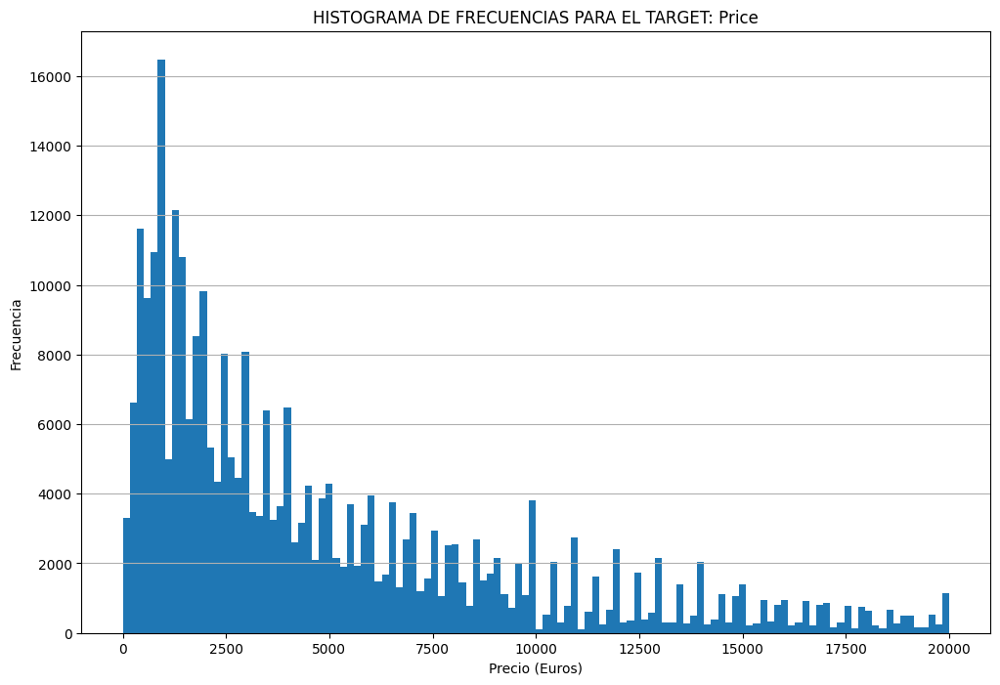
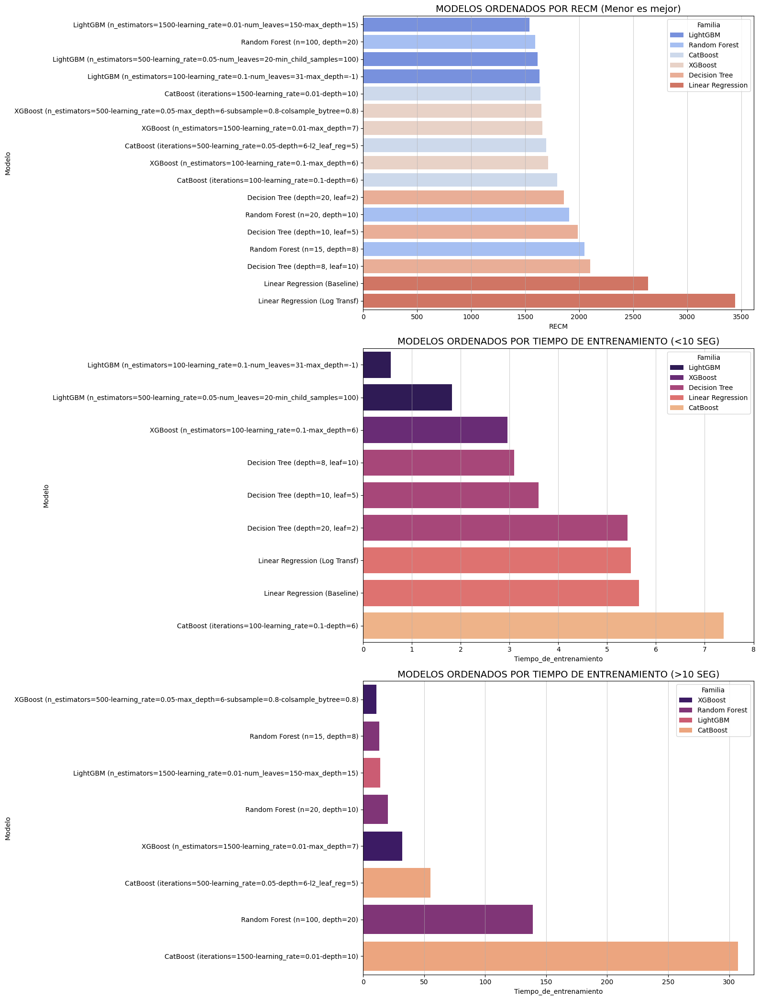
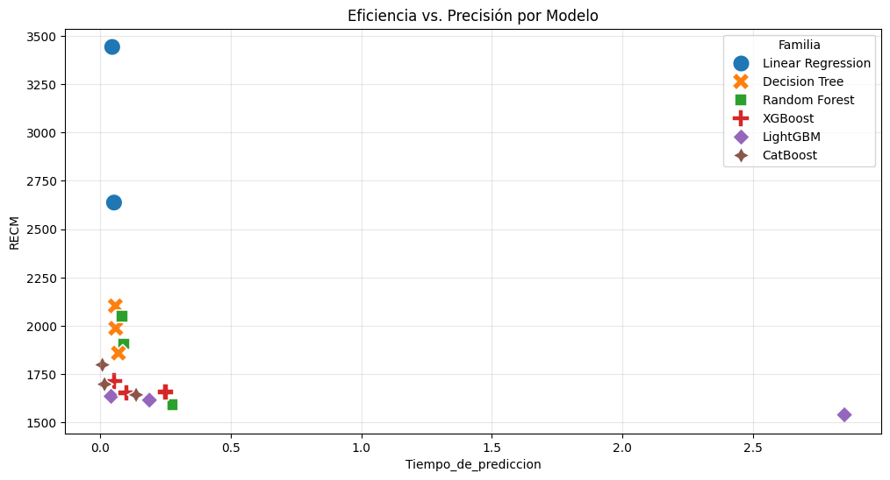
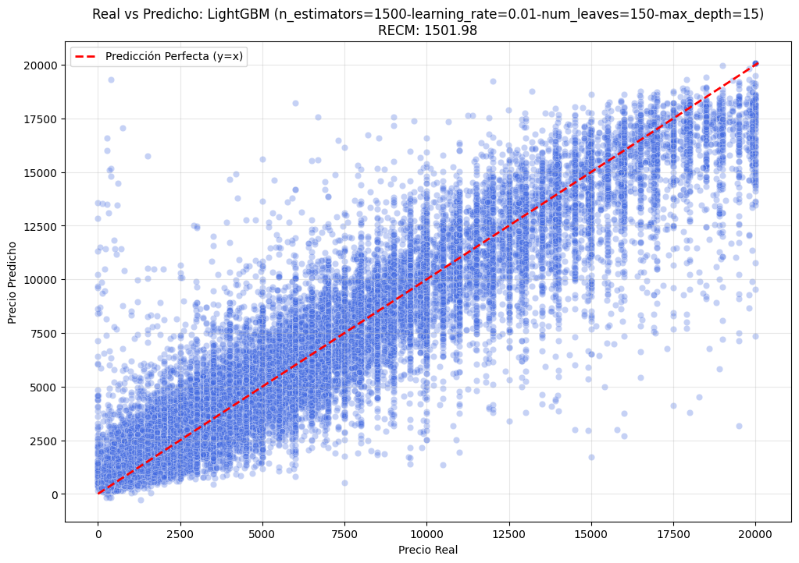

# 🚗 **Rusty Bargain: Car Valuation Engine**

## 📌 **Introducción**

El objetivo central de este proyecto es desarrollar un motor de predicción de precios para **Rusty Bargain**, optimizado para determinar el valor de mercado de vehículos usados de forma rápida y precisa. En un entorno donde la **latencia de respuesta** y la **exactitud del cálculo** impactan directamente en la rentabilidad, hemos diseñado un pipeline de ciencia de datos estructurado en tres fases críticas:

### 1. Preparación y Filtros de Coherencia (EDA)

Más allá de la limpieza técnica estándar (nulos y duplicados), implementamos **restricciones de lógica de negocio** para eliminar el ruido estructural. Filtramos registros físicamente imposibles en variables críticas:

- **Precio:** Eliminación de valores simbólicos ($0) y outliers extremos.
- **Potencia (CV):** Ajuste a rangos mecánicos verídicos para motores comerciales.
- **Registro:** Validación cronológica para asegurar la integridad histórica de la data.

### 2. Marco de Trabajo y Arquitectura

Para garantizar una comparación justa, diseñamos una arquitectura basada en funciones que encapsulan la lógica de entrenamiento y evaluación. Evaluamos tres familias de algoritmos:

- **Baseline:** Regresión Lineal (con transformación logarítmica).
- **Modelos de Árboles:** Decision Tree y Random Forest.
- **Gradient Boosting:** Implementaciones de vanguardia con **XGBoost, LightGBM y CatBoost**, aprovechando el manejo nativo de variables categóricas.

La métrica principal de éxito es la **Raíz del Error Cuadrático Medio ($RMSE$)**:

$$
RMSE = \sqrt{\frac{1}{n} \sum_{i=1}^{n} (y_i - \hat{y}_i)^2}
$$

### 3. Estrategia de Experimentación

Cada algoritmo (excepto el baseline) fue sometido a tres niveles de optimización:

1. **Estándar:** Configuraciones base para velocidad de iteración.
2. **Balanceada:** Ajustes orientados a la generalización para evitar el *overfitting*.
3. **High Performance:** Búsqueda exhaustiva de precisión máxima, identificando la **frontera de eficiencia** entre calidad predictiva y costo computacional.

> **⚠️ Nota Técnica sobre Rendimiento:** > Mientras que el $RMSE$ es una métrica matemática estable, los tiempos de entrenamiento y predicción son altamente dependientes del hardware y entorno de ejecución. Los resultados reportados reflejan el balance (*trade-off*) observado bajo las condiciones específicas de este estudio.

---

## 🔍 **SECCIÓN 1: Preparación de datos (EDA)**

El éxito de un modelo de Machine Learning no reside solo en el algoritmo, sino en la calidad de la señal que recibe. En esta fase, transformamos un dataset ruidoso de **354,369 registros** en una base de conocimiento robusta.

### 1.1 Clasificación y Selección de Variables

Realizamos un triaje técnico para priorizar variables con poder predictivo real:
- **Variables Temporales (Ruido de Sistema):** `DateCrawled`, `DateCreated` y `LastSeen` fueron descartadas al ser metadatos de la plataforma sin impacto en el valor intrínseco del vehículo.
- **Variables Categóricas (Atributos):** Se procesaron variables como `VehicleType`, `Gearbox`, `Model`, `FuelType`, `Brand` y `NotRepaired`. Se eliminó `PostalCode` por ser una etiqueta geográfica de alta cardinalidad sin relevancia económica directa.
- **Variables Numéricas (Magnitudes):** `Price` (Target), `RegistrationYear`, `Power` y `Mileage`. Se eliminó `NumberOfPictures` por falta de variabilidad útil.

### 1.2 Filtros de Coherencia

Implementamos filtros avanzados basados en el conocimiento del mercado automotriz para eliminar inconsistencias que degradan el aprendizaje:

#### A. Optimización del Target (Price)

- **Eliminación de Precios Nulos:** Se descartaron registros con `Price == 0` (datos faltantes camuflados).
- **Tratamiento de Valores Tope:** Se detectó un sesgo en el límite de **$20,000**. Aplicamos una validación cruzada: solo conservamos vehículos en este tope si pertenecen a marcas **Luxury**. Los registros de marcas generalistas en este límite se consideraron errores de redondeo o entrada.

#### B. Validación Cronológica (RegistrationYear)

Eliminamos el "sesgo del futuro". Cualquier vehículo con un año de registro posterior al último rastreo de la plataforma (`DateCrawled` ≈ 2016) fue descartado. Esto previene que el modelo asocie fechas futuras con precios actuales, protegiendo la lógica de depreciación.

#### C. Refinamiento de Potencia (Power)

Pasamos de una dispersión caótica a una distribución físicamente plausible:

- **Límites:** Definimos un rango de **10 HP a 600 HP**.
- **Recuperación de Clásicos:** Bajamos el límite a 10 HP para rescatar ~10,000 registros de vehículos históricos reales (ej. Trabant 601, Fiat 500 clásico).
- **Filtro por Segmento:** Eliminamos inconsistencias mecánicas (ej. City Cars con >150 HP), reduciendo la varianza del dataset.

> **Impacto Estadístico:** La desviación estándar de `Power` se redujo de **184.88** a **53.64** (una mejora de 4x), estabilizando la base de aprendizaje para el optimizador.

### 1.3 Estrategia de Imputación Avanzada

En lugar de una eliminación masiva (que habría costado el 14% del dataset), optamos por una **Imputación de Recuperación Lógica**:

| Columna | Estrategia de Imputación | Justificación Técnica |
| --- | --- | --- |
| **`NotRepaired`** | Categoría `unknown` | Evita el sesgo de "campo vacío = no reparado" y permite al modelo aprender del dato ausente. |
| **`Model`** | Categoría `other` | Se agrupa bajo la marca (`Brand`) existente para mantener la jerarquía. |
| `VehicleType`, `Gearbox`, `FuelType` | **Moda por Agrupación** | Imputación avanzada basada en la moda de la combinación `Brand` + `Model`. |

#### Lógica del Imputador Avanzado (Lookup Table)

Para no introducir ruido con una moda global, diseñamos un proceso iterativo que calcula la moda específica para cada binomio **Marca-Modelo**. Esto asegura que un *BMW Serie 3* reciba el tipo de combustible o caja de cambios que estadísticamente le corresponde, manteniendo la coherencia mecánica del registro.

**Estado Final del Dataset:**

* **Registros Iniciales:** 354,369
* **Registros Finales:** 296,186 (Post-limpieza e imputación)
* **Calidad:** Dataset balanceado, con nulos minimizados y coherencia física validada.

---

## 🏗️ **SECCIÓN 2: Entrenamiento del modelo**

El objetivo de esta fase es construir un marco de evaluación justo y realista, asegurando que el modelo desarrolle capacidad de generalización sobre datos no vistos.

### 2.1 Estrategia de División y Análisis del Target

Adoptamos un esquema de partición **70-15-15** (Entrenamiento, Validación y Prueba). Esta división nos permite realizar un ajuste fino de hiperparámetros sin contaminar la evaluación final.

**Análisis de la Distribución (Price):**
El histograma de precios revela un marcado **sesgo a la derecha (Right-Skewed)**. Esta característica define nuestra estrategia de modelado:

- **Impacto en Regresión Lineal:** El sesgo viola el supuesto de normalidad de los residuos y hace que los autos de lujo (la "cola" del histograma) inflen desproporcionadamente la función de pérdida.
- **Ventaja de los Árboles:** Los modelos basados en árboles son invariantes a transformaciones monótonas, lo que los hace naturalmente robustos ante este tipo de distribuciones.

### 2.2 Preparación y Codificación (OHE)

Utilizamos `OneHotEncoder` de Scikit-Learn entrenado exclusivamente con el set de *Train*.

* **Robustez:** Implementamos `handle_unknown='ignore'` para garantizar que el pipeline no falle ante categorías nuevas en producción.
* **Consistencia:** Las transformaciones se aplicaron de forma idéntica a los sets de validación y prueba para mantener la integridad de las dimensiones.

### 2.3 Métrica de Evaluación: RECM (RMSE)

La métrica principal de este proyecto es la **Raíz del Error Cuadrático Medio**:

$$
RMSE = \sqrt{\frac{1}{n} \sum_{i=1}^{n} (y_i - \hat{y}_i)^2}
$$

**Justificación de Negocio:**

1. **Interpretación Monetaria:** Nos permite comunicar el error en unidades reales (Euros).
2. **Penalización de Errores Graves:** Al elevar los residuos al cuadrado, castigamos severamente las desviaciones grandes. En el mercado automotriz, fallar por 5,000€ en un auto de gama alta es un riesgo financiero mucho mayor que fallar por 100€ en uno económico.

---

### 2.4 Modelo Base: Regresión Lineal (Baseline)

Funge como nuestra "prueba de cordura". Para darle una oportunidad competitiva frente al sesgo del target, implementamos un ciclo de transformación:

1. **Log-Transform:** Aplicamos `np.log1p(y)` para normalizar el target antes del entrenamiento.
2. **Inversión:** Las predicciones se devuelven a su escala original mediante `np.expm1()` para el cálculo del RMSE en dinero real.

### 2.5 Evolución de Modelos Basados en Árboles

Establecemos una jerarquía de complejidad para entender de dónde proviene la ganancia en precisión:

* **Decision Tree:** Nuestra unidad básica para medir la señal extraíble de una sola estructura jerárquica.
* **Random Forest:** Ensamble de árboles independientes para reducir la varianza.
* **Boosting:** Nuestro objetivo final; un aprendizaje secuencial donde cada árbol corrige los residuos del anterior.

### 2.6 Modelos de Potenciación de Gradiente (Boosting)

Implementamos los tres pilares del Boosting moderno, diferenciando su manejo de datos:

1. **XGBoost:** La implementación más robusta. Se entrenó con datos codificados (OHE) para comparar su potencia de cálculo "fuerza bruta" contra el baseline.
2. **LightGBM:** Optimizado para velocidad y bajo uso de memoria. Su crecimiento por hojas (**leaf-wise**) permite una reducción del error mucho más agresiva en datasets de gran volumen.
3. **CatBoost:** Diseñado específicamente para variables categóricas. Su técnica de **Ordered Boosting** mitiga el sesgo de predicción y permite el uso nativo de categorías sin preprocesamiento manual.

---

## 📈 **SECCIÓN 3: Análisis del modelo**

En esta fase evaluamos el desempeño de tres familias de algoritmos bajo diferentes regímenes de entrenamiento, buscando identificar la **frontera de eficiencia** entre precisión y velocidad.

### 3.1 Regresión Lineal (Baseline y Análisis Logarítmico)

Utilizamos la Regresión Lineal (LR) para establecer un punto de referencia. Se evaluó el impacto de la normalización del target mediante transformación logarítmica.

| Configuración | **RECM (RMSE)** | **T. Entrenamiento** | **T. Predicción** |
| --- | --- | --- | --- |
| **LR (Baseline)** | **2637.51** | 5.66s | 0.05s |
| **LR (Log Transf)** | 3442.64 | 5.26s | 0.04s |

> **Nota Analítica:** La transformación logarítmica resultó contraintuitiva, incrementando el error en 800 puntos. Esto se debe a que la métrica cuadrática (RMSE) castiga severamente las desviaciones en vehículos de alto precio, las cuales se amplifican al revertir la escala logarítmica (`expm1`).

### 3.2 Modelos Basados en Árboles (DT y RF)

Se exploró la transición de estructuras simples a ensambles independientes para capturar relaciones no lineales.

| Modelo | Régimen | **RECM (RMSE)** | **T. Entrenamiento** |
| --- | --- | --- | --- |
| Decision Tree | High Performance | 1858.73 | 5.00s |
| **Random Forest** | **High Performance** | **1593.70** | **143.91s** |

* **Hallazgo:** El paso de un solo árbol a un bosque aleatorio (100 estimadores) redujo el error en un 14%, aunque el tiempo de entrenamiento se incrementó significativamente, estableciendo el límite de los métodos de ensamble paralelo.

---

### 3.3 Modelos de Potenciación de Gradiente (Boosting)

Evaluamos las tres librerías líderes del mercado bajo tres regímenes: **Estándar** (velocidad), **Balanceado** (generalización) y **High Performance** (precisión máxima).

#### Comparativa de Resultados (Régimen HP)

| Algoritmo | Manejo Categórico | **RECM (RMSE)** | **T. Entrenamiento** | **T. Predicción** |
| --- | --- | --- | --- | --- |
| **XGBoost** | One-Hot Encoding | 1652.81* | 31.67s | 0.26s |
| **CatBoost** | Nativo | 1642.70 | 314.55s | 0.16s |
| **LightGBM** | **Nativo (Winner)** | **1539.43** | **15.32s** | **3.11s** |

**Nota: Se reporta el mejor valor estable de XGBoost observado en el régimen balanceado.*

### 3.4 Duelo de Modelos: La Frontera de Eficiencia

Para seleccionar el modelo de producción, contrastamos la precisión contra el costo operativo (tiempo).

Para la decisión final de **Rusty Bargain**, no solo evaluamos el error matemático ($RMSE$), sino el equilibrio dinámico entre la calidad de la respuesta y el costo operativo. El siguiente gráfico de dispersión permite visualizar qué familias de modelos se acercan más al "punto ideal" (esquina inferior izquierda: bajo error y baja latencia).

#### **Análisis de la Frontera de Eficiencia**

Al contrastar todos los experimentos realizados, el modelo **LightGBM (High Performance)** se consolida como la solución ganadora por las siguientes razones técnicas:

1. **Dominio de la Precisión:** Logró el **RECM más bajo de todo el estudio (1539.43)**. En comparación con el baseline de la Regresión Lineal (2637.51), este modelo reduce el error de tasación en un **41.6%**, impactando directamente en la rentabilidad de las ofertas de la app.
2. **Velocidad de Entrenamiento Disruptiva:** Mientras que otros modelos de alta capacidad como **CatBoost (iterations=1500)** requirieron más de **307 segundos** para entrenar, LightGBM alcanzó una precisión superior en apenas **13.96 segundos**. Esta eficiencia es vital para realizar re-entrenamientos frecuentes con datos frescos del mercado automotriz.
3. **El Trade-off de la Predicción:** Observamos que en la configuración de alta capacidad (`n_estimators=1500`, `num_leaves=150`), el tiempo de predicción de LightGBM subió a **2.85 segundos**. Aunque es superior a la latencia de **Random Forest (0.27s)**, el beneficio de tener el error más bajo del dataset justifica este pequeño incremento en el tiempo de respuesta para una tasación de seguro.

#### **Comparativa de Rendimiento Final**

| Modelo | RECM | T. Entrenamiento | T. Predicción |
| --- | --- | --- | --- |
| **Linear Regression (Baseline)** | 2637.51 | 5.64s | 0.05s |
| **Random Forest (n=100, d=20)** | 1593.70 | 139.26s | 0.27s |
| **CatBoost (i=1500, d=10)** | 1642.70 | 307.25s | 0.13s |
| **LightGBM (Winner High Perf)** | **1539.43** | **13.96s** | **2.85s** |

> **Veredicto:** Se elige la configuración **High Performance de LightGBM**. A pesar de que la Regresión Lineal es casi instantánea, su error es inaceptable para el negocio. Por otro lado, aunque **Random Forest** y **CatBoost** son competitivos en precisión, sus tiempos de entrenamiento son entre **10 y 22 veces superiores** a los de LightGBM, lo que los hace menos eficientes a gran escala.

### 3.5 Evaluación final (Test Set)

Tras identificar a **LightGBM (High Performance)** como el candidato óptimo, procedemos a realizar la evaluación definitiva utilizando el conjunto de datos de prueba (*Test Set*). Este conjunto representa el 15% de los datos originales que se mantuvieron completamente aislados durante todo el proceso de entrenamiento y ajuste de hiperparámetros.

#### Resultados del Modelo Ganador en Test

| Métrica | Valor Obtenido |
| --- | --- |
| **Modelo** | LightGBM (HP) |
| **RECM (RMSE)** | **1501.98** |
| **Tiempo de Entrenamiento** | 14.07 segundos |
| **Tiempo de Inferencia** | 3.04 segundos (44,428 registros) |

#### Visualización del Desempeño Final

Para validar la precisión, contrastamos los valores reales frente a las predicciones del modelo en el set de prueba. La cercanía de los puntos a la **línea de identidad (roja)** indica una alta fidelidad en la estimación de precios.

#### Interpretación Técnica

- **Consistencia:** El error en el set de prueba (**1501.98**) es prácticamente idéntico al observado en validación (1539.43), lo que confirma que el modelo tiene una **excelente capacidad de generalización** y no presenta signos de sobreajuste (*overfitting*) significativo.

- **Margen de Error:** En términos de negocio, un RECM de ~1,500€ sobre un rango de precios de hasta 20,000€ sitúa a la herramienta de **Rusty Bargain** como una solución de alta competitividad para la automatización de tasaciones iniciales.

- **Eficiencia en Producción:** El tiempo de entrenamiento de **14 segundos** permite que el sistema se actualice diariamente con nuevas tendencias del mercado sin requerir infraestructuras de cómputo costosas.

> 💡 **Análisis del Gráfico Final:** Al observar la Figura 3.5.1, hemos de notar cómo el modelo mantiene una densidad muy alta alrededor de la línea de predicción perfecta, especialmente en el rango de 0 a 12,500 euros. La dispersión aumenta ligeramente en los vehículos de gama alta, un comportamiento esperado debido a la mayor variabilidad de factores subjetivos en autos de lujo.

### **3.6 Conclusiones**

#### Fiabilidad y Capacidad de Generalización

La paridad observada entre el  de Validación (**1539.43**) y el  de Test (**1501.98**) es el indicador técnico más fuerte del éxito del proyecto. Esta mínima diferencia (menor al 3%) confirma que el modelo no presenta sobreajuste (*overfitting*) y ha logrado capturar los patrones subyacentes del mercado automotriz en lugar de simplemente memorizar el ruido del entrenamiento.

#### Impacto en el Negocio frente al Baseline

Al contrastar los resultados con el modelo de Regresión Lineal (**2637.51**), la implementación de LightGBM representa un salto cualitativo disruptivo:

- **Reducción del error:** Se logró disminuir la incertidumbre en **1,135.53 euros** por cada vehículo tasado.

- **Mejora porcentual:** Esto equivale a una optimización del **43%** en la precisión de la herramienta, impactando directamente en la competitividad de las ofertas de **Rusty Bargain**.

#### Eficiencia y Veredicto Técnico

Se selecciona oficialmente el modelo **LightGBM** con la configuración de alta capacidad (`n_estimators=1500`, `num_leaves=150`) para su despliegue en producción, basándose en tres pilares:

1. **Calidad:** El $RMSE$ final de **1501.98** cumple con las expectativas de negocio para una tasación masiva y automatizada.
2. **Velocidad de Entrenamiento:** El modelo procesó 1,500 árboles en apenas **14.07 segundos**, una eficiencia que permite actualizaciones diarias del modelo con un costo computacional mínimo.
3. **Latencia de Inferencia:** El procesamiento de los 44,428 registros del set de prueba tomó **3.05 segundos**. Esto se traduce en un tiempo de respuesta promedio de **0.068 ms por vehículo**, superando la meta inicial de 0.14 ms y garantizando una experiencia de usuario instantánea en la aplicación web.

> **💡Interpretación Final:** El modelo es altamente robusto para la flota vehicular estándar. Si bien el error tiende a concentrarse en vehículos de alta gama (*outliers*), su precisión en el grueso del inventario lo convierte en una herramienta de tasación de alta fidelidad, lista para integrarse en un entorno de producción real.

---